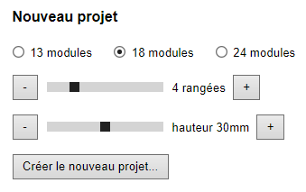

# Tiquettes

Générateur d'étiquettes pour tableaux / armoires électriques.

---

https://pantaflex44.github.io/Tiquettes/


<u>Licence</u>: MIT<br />
<u>Auteur</u>: Christophe LEMOINE <pantaflex (at) hotmail (dot) fr><br />
<u>Version</u>: 1.1<br />
<u>Création</u>: 26/05/2024<br />

---

## Le projet

Tout commence par l'initialisation de son projet.

Deux possibilités:

- Créer un nouveau projet par défaut
- Importer un projet sauvegarder




### Créer un nouveau projet par défaut

L'application définit automatiquement un tableau électrique de 4 rangées, 13 modules par rangée avec une hauteur des étiquettes de 30mm.

Bien évidement vous pouvez modifier ces valeurs en agissant sur les réglages des étapes 1 à 3. Commencez par le réglage du nombre de rangées, puis de la hauteur des étiquettes et finissez par le choix du nombre de modules.

Le tableau s'ajustera automatiquement.

ATTENTION: ne pas agir sur ces réglages pendant la définition des étiquettes sous peine de perdre votre travail.

### Importer un projet sauvegarder

Tiquettes vous propose d'importer et d'exporter votre travail pour l'archiver ou y retravailler ultérieurement. Une sauvegarde automatique de votre session de travail est aussi intégrée au système.

Pour importer un projet, cliquez sur le bouton ```Choisir un fichier``` puis chargez le fichier correspondant à votre projet. Immédiatement, celui-ci s'affichera plus bas!

## Utilisation

Un tableau peut comporter de 1 à 15 rangées, 13, 18 ou 24 modules par rangée.

Chaque module peut avoir une largeur réglable en fonction de la place disponible à sa droite. Vous pourrez l'étendre jusqu'à rencontrer, soit le bout de la rangée, soit un autre module déja défini. Vous devrez libérer celui-ci pour pousuivre son expansion.


Le symbole [ + ] vous permet d'agrandir le module d'une largeur sur sa droite.


Le symbole [ - ] vous permet de réduire le module d'une largeur.


Le symbole [ O ] permet de libérer le module. Il perdra son identifiant, son icône, et sa définition mais conservera sa taille. Il pourra donc de nouveau être englobé dans l'agrandissement des modules précédents.


Le symbole ci-dessus permet d'éditer le module en question.

## Edition d'un module

Après avoir cliqué sur le symbole d'édition d'un module, une fenêtre popup s'ouvre et vous offre la possibilité d'affiner sa définition.


- *Identifiant* : Identifiant technique du module. Seules les lettres, chiffres et le caractère point son acceptés.
- *Description* : Une très courte description du module. Les retours à la ligne sont pris en compte.
- *Pictogramme* : Une petite image illustrant l'environement du module.
- *Afficher l'identifiant* : Affiche ou non l'identifiant.
- *Afficher le pictogramme* : Affiche ou non le pictogramme.
- *Afficher la description* : Affiche ou non la description.
- *Couleur de fond* : Couleur de fond de la description.
- *Couleur du texte*: Couleur du texte de la description.

## Immortaliser son travail

Une fois vos étiquettes réalisées, vous pourrez les imprimer en cliquant sur le bouton adéquat.

Sélectionnez le mode ```paysage``` pour simplifier la mise en page.

Choisissez d'imprimer le fond et les images pour avoir un rendu tel votre écran.

## Fin!